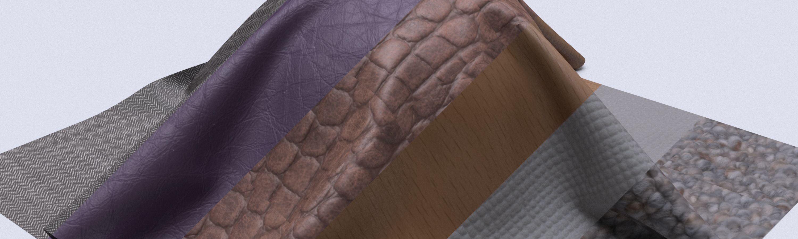
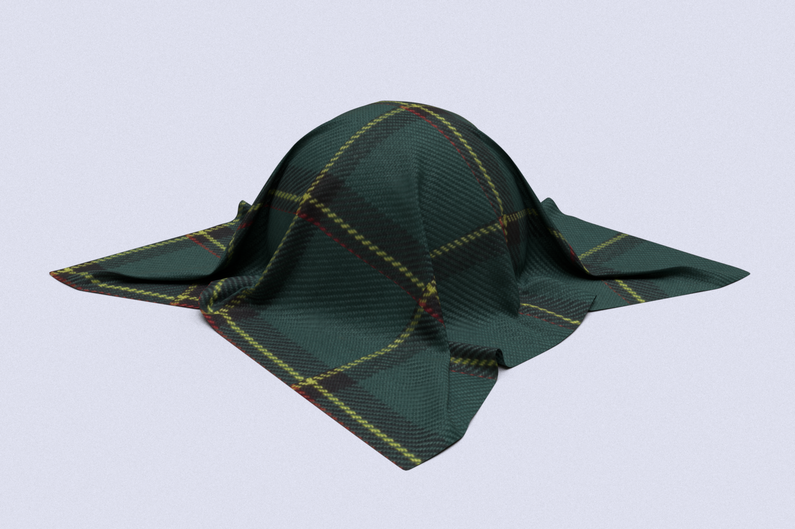
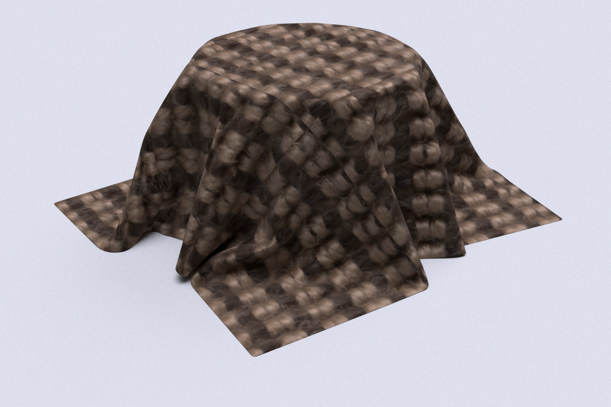
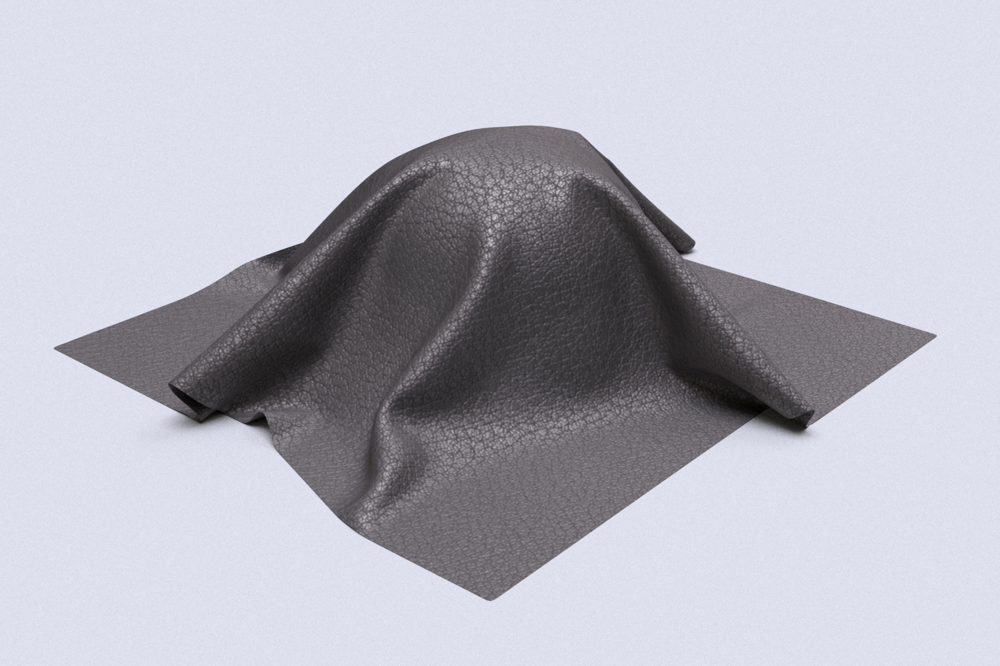
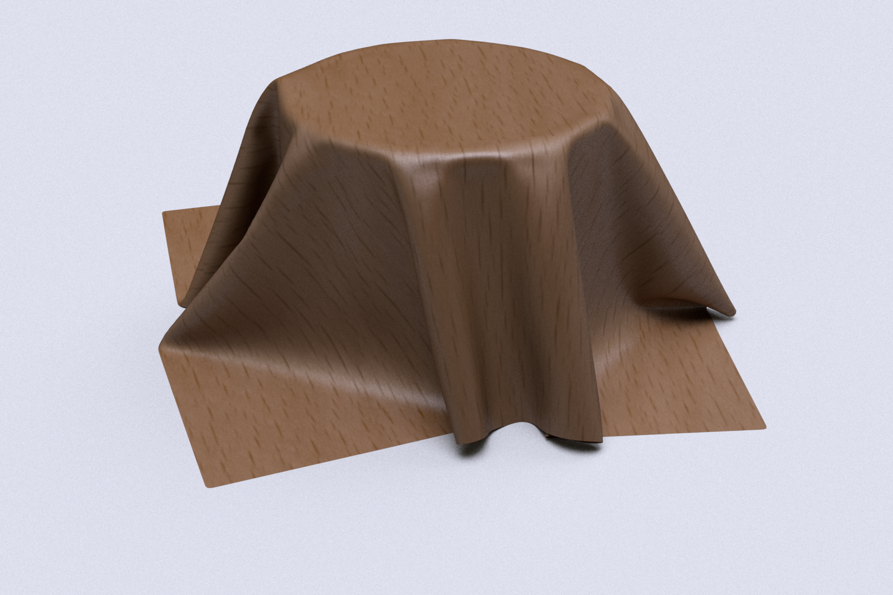

# NeuBTF

In this repo you can find our implementation of

>   
> **Neural Bidirectional Texture Function Compression and Rendering**  
> SIGGRAPH Asia 2022 Posters, December 2022.  
> [Luca Quartesan](luca@traverseresearch.nl), [Carlos Santos](santos.c@buas.nl)

## Requirements
 
We provide an `environment.yml` to install all requirements using anaconda. If you use another package manager this file shoudl still provide the core packages required to run our experiments.

We recommend the use of a GPU with cuda capabilities to obtain expected perfomance.

## Structure

Our pytorch implementation can be found in the folder `/src`

We provide a series of notebooks in the folder `/nbs`:
+ [ubo2014 dataset exploration](/nbs/ubo2014_dataset.ipynb) which also provides a script to download the dataset
+ [ubo2014 training](/nbs/ubo2014_train.ipynb) shows how the one can train a material and render it in Mitsuba 2

The provided code expects the dataset to be stored in `/dataset`, if downloaded with the code provided in the [dataset notebook](/nbs/ubo2014_dataset.ipynb) will be automatically collected there

## Scenes
> To succesfully render in Mitsuba 2 using the provided scenes read [this](scenes/README.md)

few examples trained on UBO2014 dataset and rendered in Mitsuba2 with the scenes provided in `scenes/`.

fabric09             |  carpet07
:-------------------------:|:-------------------------:
  |  

leather07             |  wood08
:-------------------------:|:-------------------------:
  |  


### Citation
```bibtex
@article{quartesan2022neubtf,
  title   = "Neural Bidirectional Texture Function Compression and Rendering",
  author  = "Luca Quartesan and Carlos Pereira Santos",
  journal = "SIGGRAPH Asia 2022 Posters (SA '22 Posters), December 06-09, 2022"
  year = {2022},
  month = dec,
  numpages = {2},
  url = {https://doi.org/10.1145/3550082.3564188},
  doi = {10.1145/3550082.3564188},
  publisher = {ACM},
}

```