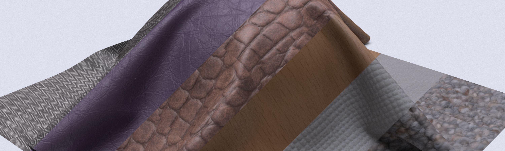
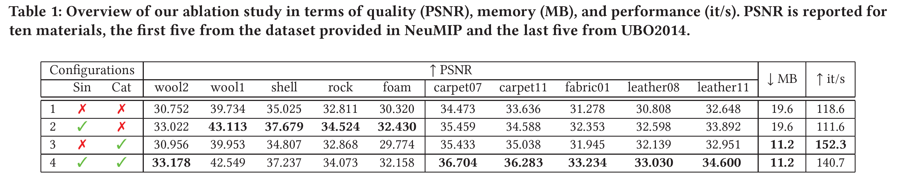
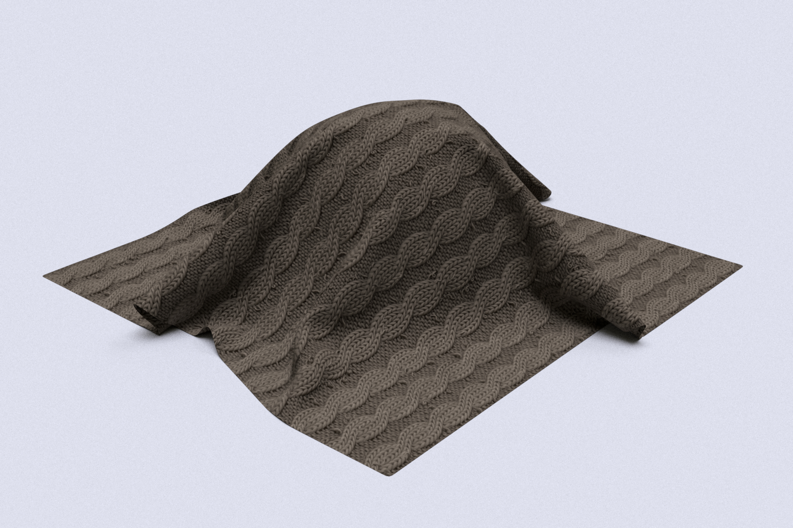
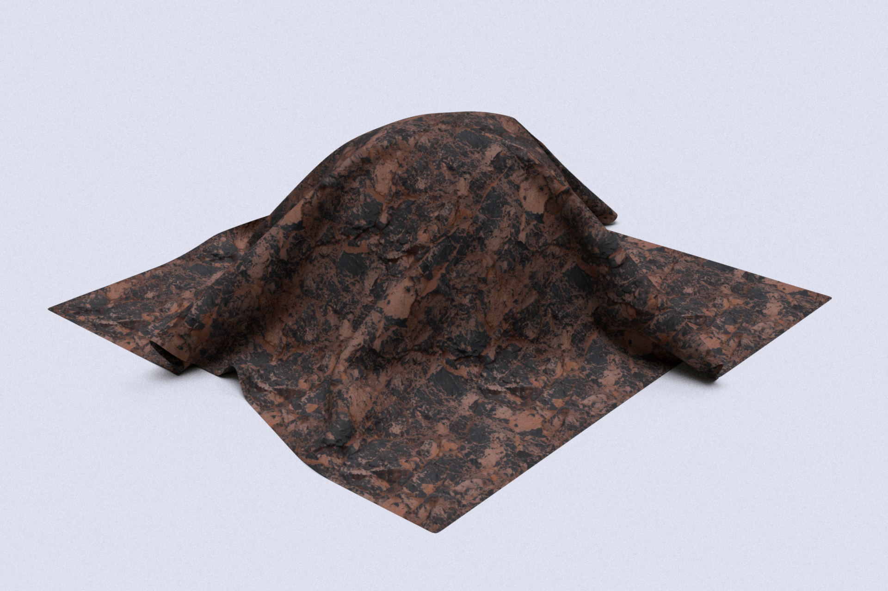
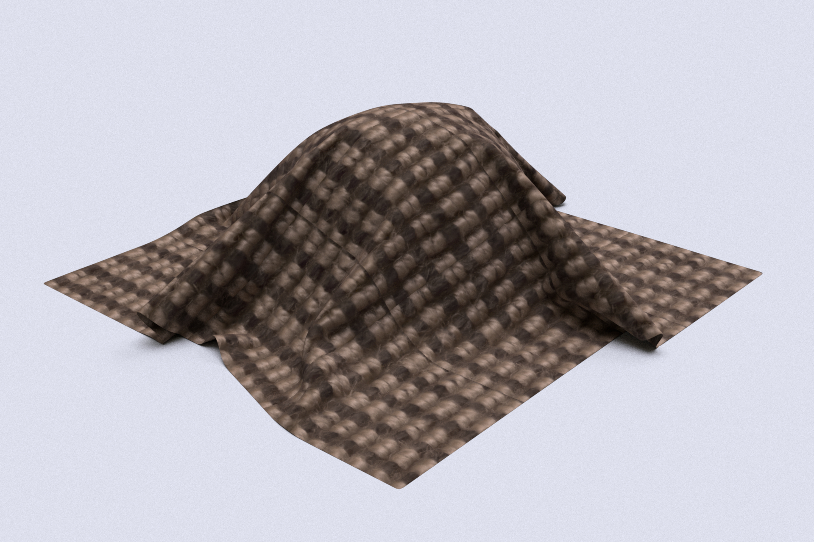
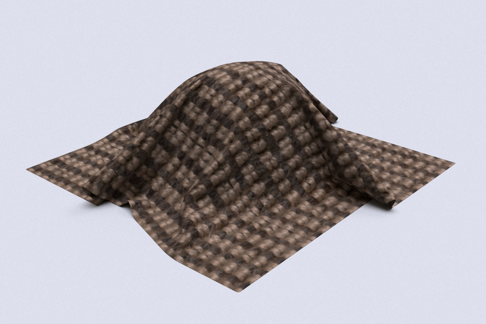
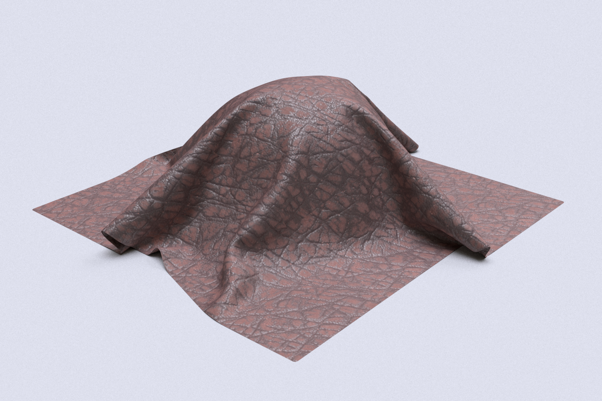
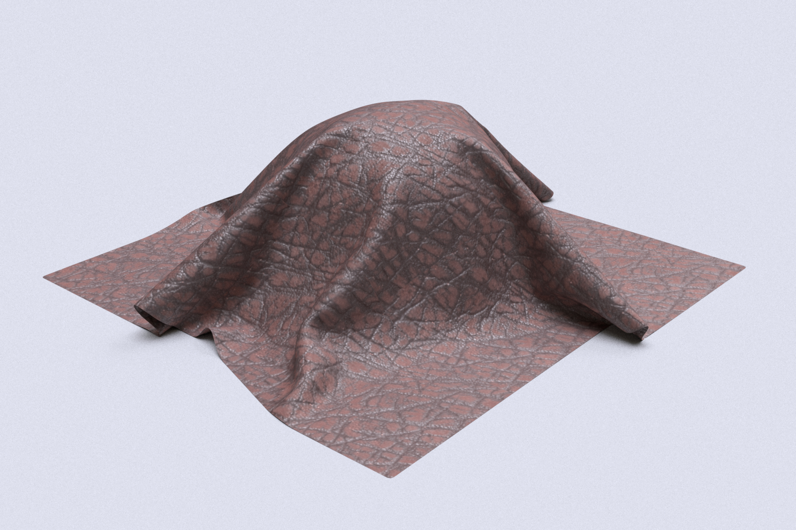

## Context
Bidirectional Texture Function (BTF) is a data-driven representation of surface materials that can encapsulate complex behaviors, such as self-shadowing and interreflections, that would otherwise be too expensive to render. BTFs can be captured by taking samples from a combination of light and view directions.
Neural Networks can learn from BTF data; the current SOTA is called NeuMIP. We propose two changes (Sin, Cat) to improve this technique in terms of memory, performance and quality.
Finally, we show that Neural BTF can be easily integrated into rendering engines by implementing it in Mitsuba 2.

## Method
We propose two changes. We replace the ReLUactivations with a Sine (Sin) as presented in Siren and use a different multi-level sampling like the one proposed in Instant-NGP, where we concatenate (Cat) results from different levels instead of reducing them through interpolation.
We perform an ablation study over the two proposed changes to evaluate their impact on memory, performance and quality.
We run the experiments on two datasets:
1. UBO2014, real captures.
2. MBTF from NeuMIP, synthetic.


## Results


+ Our results show that our method (configuration 4) achieves better compression quality while using less memory and performance than the baseline.
+ Neural BTF is part of the broader field of neural scene representation.

### Comparisons
Following we show a comparison between the baseline (NeuMIP) and our models using configuration 4.  
> 💡 Note that we train both models for 15000 epochs, which is half of the epochs used in the results reported in NeuMIP. 

#### NeuMIP materials

##### Wool2
<div class="juxtapose" width="100%">
    
    
</div>

##### Cliff
<div class="juxtapose" width="100%">
    
    
</div>


#### UBO2014 Materials

##### Carpet07
<div class="juxtapose" width="100%">
    
    
</div>

##### Leather08
<div class="juxtapose" width="100%">
    
    
</div>


## Discussion
+ When used in a simulation the material only behaves as a diffuse PDF.
+ We do not report performance results from a real-time implementation.

## Paper
**Neural Bidirectional Texture Function Compression and Rendering**  
Luca Quartesan and Carlos Pereira Santos
+ [Paper preprint](assets/neubtf22.pdf)
+ [BibTeX](assets/quartesan22neubtf.bib)
+ [Code](https://github.com/Traverse-Research/NeuBTF)

## Citation
```bibtex
@article{quartesan2022neubtf,
  title   = "Neural Bidirectional Texture Function Compression and Rendering",
  author  = "Luca Quartesan and Carlos Pereira Santos",
  journal = "SIGGRAPH Asia 2022 Posters (SA '22 Posters), December 06-09, 2022",
  year = {2022},
  month = dec,
  numpages = {2},
  url = {https://doi.org/10.1145/3550082.3564188},
  doi = {10.1145/3550082.3564188},
  publisher = {ACM},
}

```

<script src="https://cdn.knightlab.com/libs/juxtapose/latest/js/juxtapose.min.js"></script>
<link rel="stylesheet" href="https://cdn.knightlab.com/libs/juxtapose/latest/css/juxtapose.css">
