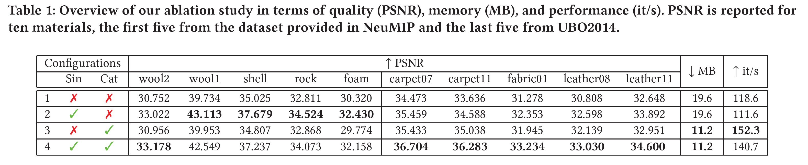

# Results

## Comparisons
Following we show a comparison between the baseline (NeuMIP) and our models using configuration 4.  
> 💡 Note that we train both models for 15000 epochs, which is half of the epochs used in the results reported in NeuMIP. 

### NeuMIP materials

#### Wool2

    
    

#### Wool1

    
    

#### Cliff

    
    

#### Foam

    
    

#### Shell

    
    

### UBO2014 Materials

#### Carpet07

    
    

#### Carpet11

    
    

#### Fabric01

    
    

#### Leather08

    
    

#### Leather11

    
    

<link rel="stylesheet" href="https://cdn.knightlab.com/libs/juxtapose/latest/css/juxtapose.css">